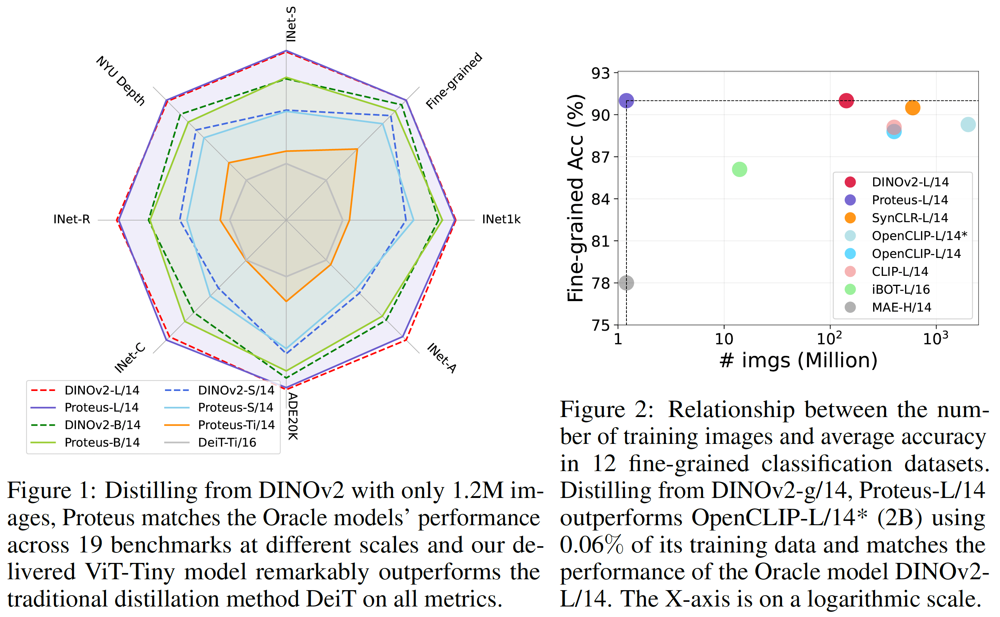
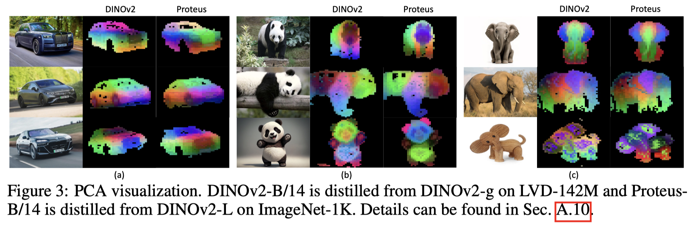
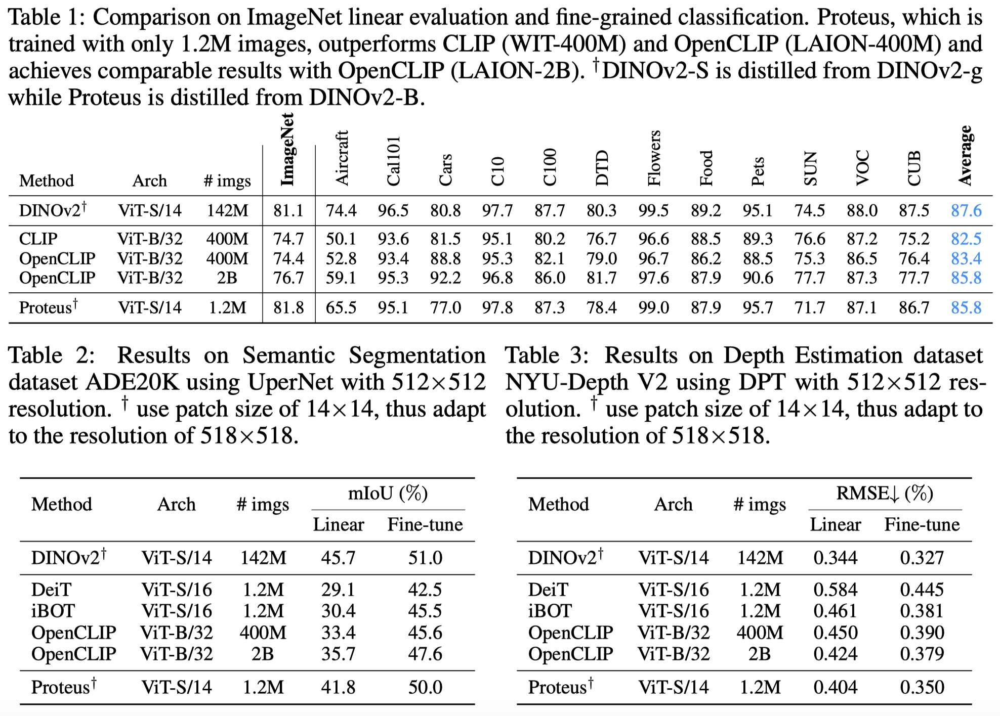
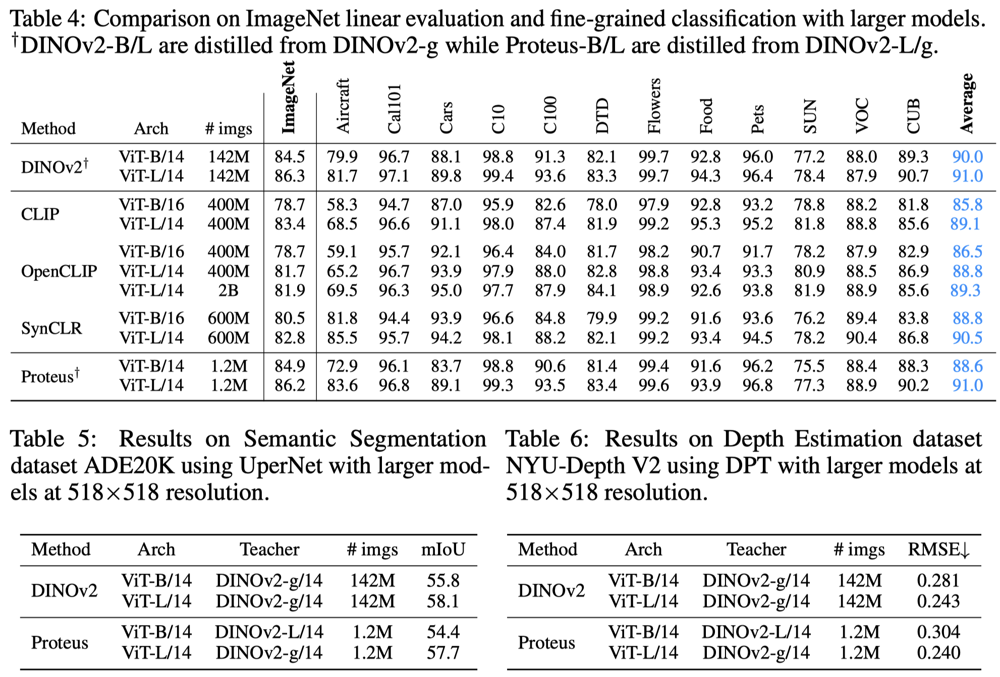
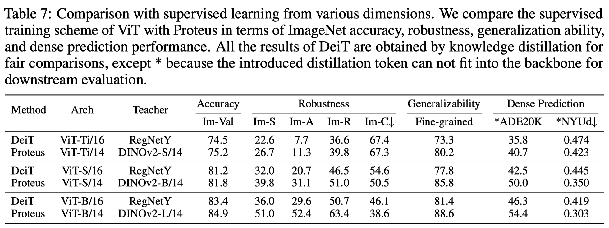
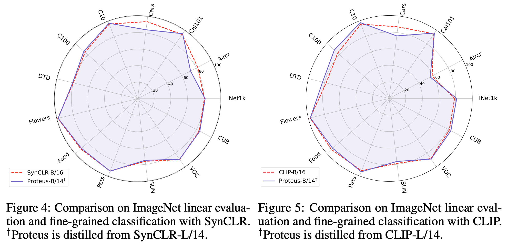
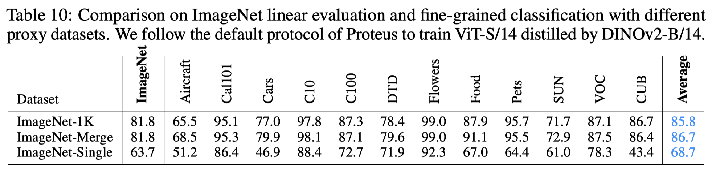
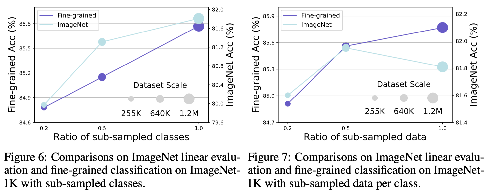

  

# Accessing Vision Foundation Models at ImageNet-level Costs

  

## TL,DR
- `Motivation`: Vision foundation models are renowned for their generalization ability due to massive training data. Nevertheless, they demand tremendous training resources, and the training data is often inaccessible, e.g., CLIP, DINOv2. 
- `Solution`: We offer a very simple and general solution, named Proteus, to distill foundation models into smaller equivalents on ImageNet-1K without access to the original training data.
- `Strength`: 
    - (1) Small Training Costs (similar to DeiT distillation on ImageNet-1K) 
    - (2) Strong Performance (similar to foundation models trained with tons of data) 
    - (3) Generalization Ability (validated across DINOv2, CLIP, SynCLR)

  

## Methodology

Proteus is a simple and general distillation framework which has two distinct features compared to conventional knowledge distillation:

- **Combating Dataset Bias**: We find the introduction of one-hot labels and the projection head will lead to dataset bias. Consequently, we perform distillation on the intermediate features and discard the labels.

- **Multi-level Training Objectives**: We construct the proxy task by combining the token-level, patch-level, and feature-level learning objectives to learn the general-purpose visual representations, ensuring the performance of Proteus across various tasks.

## Support Methods

Proteus can easily generalize to existing vision foundation models to access them at much smaller costs. Currently, Proteus supports the training of [DINOv2](https://arxiv.org/abs/2304.07193), [CLIP](https://arxiv.org/abs/2103.00020), [SynCLR](https://arxiv.org/abs/2312.17742). Please feel free to contact us if you want to contribute the implementation of other methods.

## Result

- Accessing DINOv2
  
  DINOv2 is trained on private large-scale dataset LVD-142M and we utilize the pre-trained DINOv2 as the teacher to train a randomly initialized network on ImageNet-1K. We validate Proteus across ImageNet-1K, 12 fine-grained classification datasets, semantic segmentation dataset ADE20K and depth estimation dataset NYU-Depth V2 following DINOv2.

    - Target Model: ViT-S

    Proteus-S clearly outperforms other baseline methods on different tasks and slightly lags behind the Oracle method DINOv2-S with much less training data.
  
    

    
    

    - Target Model: ViT-B and ViT-L

    The performance gap between Proteus and the Oracle method DINOv2 is enclosed when we scale up the model size. Proteus-L almost matches the performance of DINOv2-L across various tasks.

    

    
    

    - Comparison with Distillation in Supervised Learning

    Proteus outperforms traditional supervised training across various dimensions with similar costs, offering a novel training scheme enhanced by foundation models.

    

    
    

We provide the pretrained Proteus distilled from DINOv2:
| Model | Backbone Weight | ImageNet |  Fine-grained  | ADE20K |  NYU-Depth V2  |
| --------------- | --------------- | ------------- |------------- | ------------- | ------------- |
| ViT-Ti  | [download](https://drive.google.com/file/d/1fTQDf1e9h1D_tWA0cXany_GCiQTISXKP/view?usp=drive_link) | 75.2% | 80.2% | 40.7%, [weight](https://drive.google.com/file/d/1a-RRx9jDhdKzSRQyYubatEDxh-khFOSm/view?usp=drive_link) | 0.423, [weight](https://drive.google.com/file/d/1IH-QXueCfSrhY21mrSHpCZLA289yBARv/view?usp=drive_link) |
| ViT-S  | [download](https://drive.google.com/file/d/1qL_vnpO5uaTXoVeopkXvDPhppcGuUGS2/view?usp=drive_link) | 81.8% | 85.8% | 50.0%, [weight](https://drive.google.com/file/d/1_IBYncFUzURIr6FaF7B417Hy0f9Bbh-r/view?usp=drive_link) | 0.350, [weight](https://drive.google.com/file/d/1LwOeNyyBhW1FYzymY_CmJ45xA-2G0ReA/view?usp=drive_link) |
| ViT-B  | [download](https://drive.google.com/file/d/1CZoN_WRiIXLmGEhd9mJayk5idddpxpLL/view?usp=drive_link) | 84.9% | 88.6% | 54.4%, [weight](https://drive.google.com/file/d/1vFPK5UOmUcLwVV0jAOrOybKMw15AUZ29/view?usp=drive_link) | 0.303, [weight](https://drive.google.com/file/d/1DpGNILjL9cqGiQ1zasCnMD5DS5RiQu8O/view?usp=drive_link) |
| ViT-L  | [download](https://drive.google.com/file/d/1nHfrpq82fM96eEufnKS_NwRcR0aaLlV6/view?usp=drive_link) | 86.2% | 91.0% | 57.7%, [weight](https://drive.google.com/file/d/1-HMJCWBD2ebCTML4QPYPFBG-0CbludcW/view?usp=drive_link) | 0.240, [weight](https://drive.google.com/file/d/1QLkaFS5h9nraOzjA7RxbSgzQtFLbPAgq/view?usp=drive_link) |

- Accessing SynCLR and CLIP

  We test the generalization ability of Proteus by leveraging other foundation models SynCLR and CLIP as the teacher networks. SynCLR is trained with the contrastive learning objective on the undisclosed 600M synthetic dataset, while CLIP is obtained by aligning images and corresponding text descriptions through contrastive learning on the private dataset WIT-400M.

  

We provide the pretrained Proteus distilled from SynCLR:
| Model | Backbone Weight | ImageNet |  Fine-grained  |
| --------------- | --------------- | ------------- |------------- |
| ViT-B  | [download](https://drive.google.com/file/d/1u8nC4JuTy11zb34DQTf3tU_PX1o8mfVe/view?usp=drive_link) | 81.4% | 87.4% |

and CLIP:
| Model | Backbone Weight | ImageNet |  Fine-grained  |
| --------------- | --------------- | ------------- |------------- |
| ViT-B  | [download](https://drive.google.com/file/d/1KOQQFEhEW3ILASxEp1iW27OM_s1qSPQk/view?usp=drive_link) | 81.2% | 85.7% |

- Ablation on Proxy Dataset

  - Dataset Diversity

  The generalization ability of Proteus can be improved if we increase the diversity of the proxy dataset and Proteus is robust even under the extreme scenario when we only have a single image to represent the proxy dataset.

  

    
  

  - Scaling Behavior

  Proteus is robust when we either sub-sample a portion of data at each class or sub-sample a portion of classes from the total 1000 classes. It suggests that it is feasible to access foundation models with even smaller data scales.

  

    
  

## Get Started

We provide a comprehensive codebase which contains the implementation of [Pre-training on ImageNet-1K](pretrain/), [ImageNet-1K Linear Evaluation](eval/ImageNet_probing/), [Fine-grained Classification](eval/fine_grained/) and [Semantic Segmentation and Depth Estimation](eval/dense_prediction/). Please go to the folders for specific docs.

## Acknowledgment

Our codebase is heavily build upon [DeiT](https://github.com/facebookresearch/deit?tab=readme-ov-file), [DINOv2](https://github.com/facebookresearch/dinov2), [SynCLR](https://github.com/google-research/syn-rep-learn/tree/main/SynCLR), [mmsegmentation](https://github.com/open-mmlab/mmsegmentation) and [Monocular-Depth-Estimation-Toolbox](https://github.com/zhyever/Monocular-Depth-Estimation-Toolbox/tree/main). We gratefully thank the authors for their wonderful works.